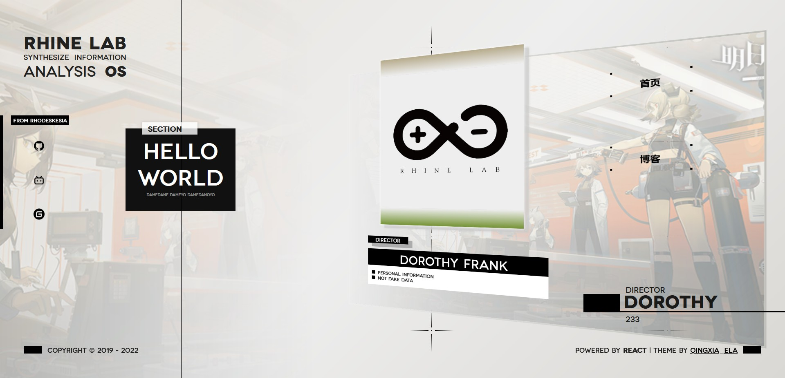
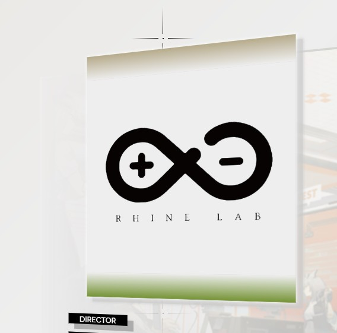
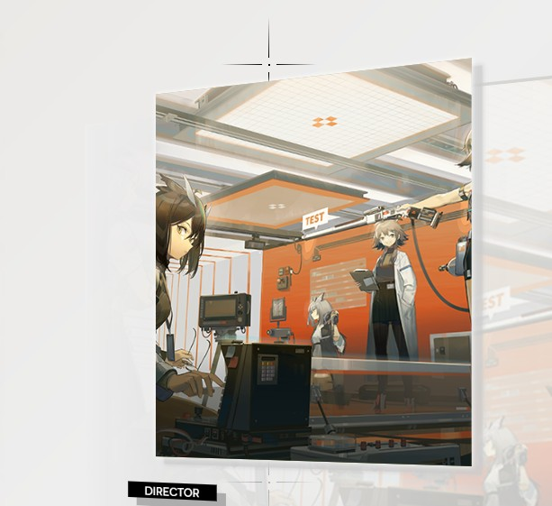
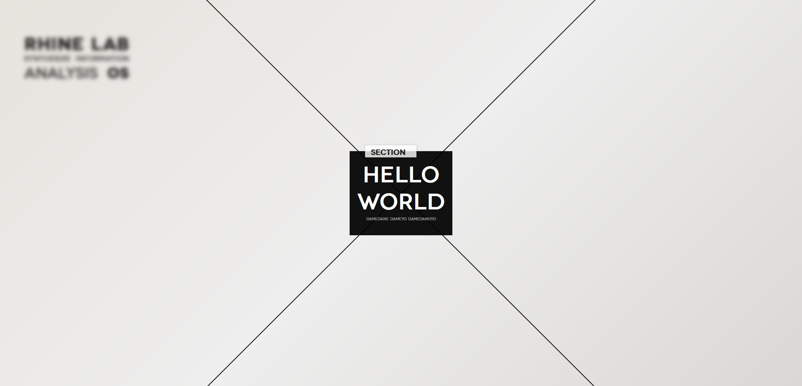
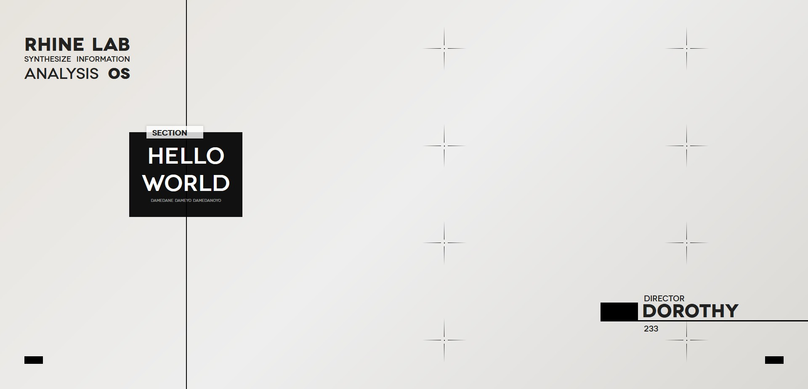
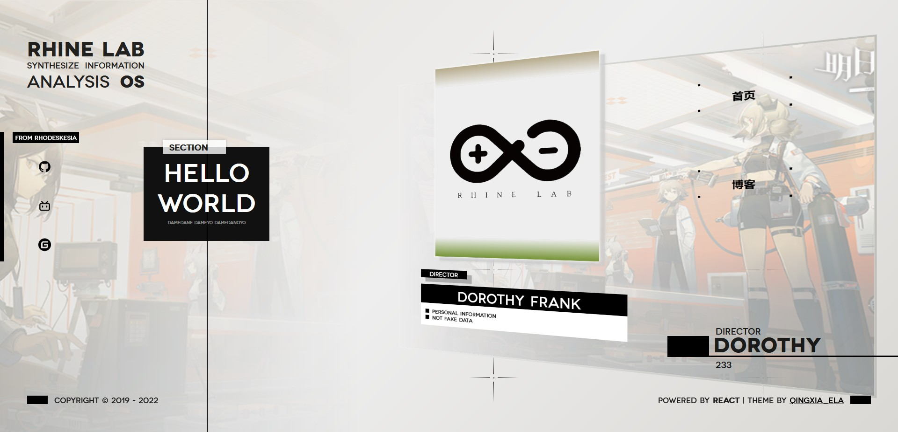

# 莱茵生命风格个人网站引导主页

[](https://www.oscs1024.com/project/QingXia-Ela/Rhine-Lab-Theme-Index-Page?ref=badge_small)

## 前言

1. **本作品开源，免费，但页面禁止用于商业使用**
2. 目前页面没有继续更新的打算，但是 issue 和 pull request 本人都会认真看的
3. 新手第一个 React 项目， 做的不好还请多多包涵

## 页面信息

使用 react 制作

字体：
英文：Novecento wide
中文：思源黑体

网页是自适应网页，**但不推荐移动端横屏访问，效果很差！**

移动端窗口分界线： 992px

## 参考 & 使用素材

[莱茵生命PPT模板](https://www.bilibili.com/video/BV19Z4y187gi)

[明日方舟莱茵生命特别映像](https://www.bilibili.com/video/BV1rr4y1b7sz)

## 预览图



## 安装 / 启动项目

```bash

# 克隆项目
# github
git clone https://github.com/QingXia-Ela/Rhine-Lab-Theme-Index-Page.git
# gitee
git clone https://gitee.com/shiinafan/Rhine-Lab-Theme-Index-Page.git

# 进入项目目录
cd Rhine-Lab-Theme-Index-Page

# 安装依赖
npm install

# 可以通过如下操作解决 npm 下载速度慢的问题
npm install --registry=https://registry.npm.taobao.org

# 启动服务
npm start

```

## 发布

```bash
# 构建生产环境
npm run build
```

## 自定义内容须知

以下所有 `主页` 代表该路径：`./src/pages/mainPage`

## 左侧内容自定义

### 左边背景图

对应 `./src/components/leftBackground`

修改背景图在 `主页` 下对 `<LeftBackground />` 组件传值

```jsx
<LeftBackground bgPath={'./images/rhineLab.png'} />
```

图片存放在 `./public/images` 下

### 左侧 HelloWorld

对应 `./src/components/leftBlackBox`

需要修改内容直接上面文件夹的 `index.jsx` 下修改

### 左上角信息

对应 `./src/components/leftTopInfo`

需要修改内容直接上面文件夹的 `index.jsx` 下修改

每一个词都要用一个标签包起来，否则可能有 bug

### 左中外链

对应 `./src/components/leftMiddleInfo`

需要修改内容直接上面文件夹的 `index.jsx` 下修改

```jsx
class LeftMiddleInfo extends Component {
  render() {
    return (
      <div className="left_middle_info">
        <div className="contact_box">
          <div className="title_box">
          // 黑底小标题
            <span>from rhodeskesia</span>
          </div>
          <div className="contact_link">
          // 使用 a 标签放图标
            <a href="https://github.com/QingXia-Ela/Rhine-Lab-Theme-Index-Page" className="iconfont icon-github"> </a>
          </div>
        </div>
      </div>
    );
  }
}
```

字体图标请在当前组件下的 `index.scss` 引入

### 左下版权

对应 `./src/components/leftBottomInfo`

修改内容请在 `主页` 下对 `<LeftBottomInfo></ LeftBottomInfo>` 组件传值

## 右侧内容自定义

### 右侧姓名

对应 `./src/components/rightInfo`

修改内容请在 `主页` 下对 `<LeftBottomInfo></ LeftBottomInfo>` 组件传值

示例：`<RightInfo title={'director'} name={'DOROTHY'} uid={233} />`

### 右下角信息

对应 `./src/components/authorInfo`

修改内容请在 `主页` 下对 `<AuthorInfo></ AuthorInfo>` 组件传值

示例：
```html
<AuthorInfo>
  powered by
    <strong>&nbsp;React</strong>
    | theme by   
  <a href='#'>QingXia_Ela</a>
</AuthorInfo>
```

### 右侧十字装饰

对应 `./src/components/rightBackground`

如不需要请直接在 `主页` 下移除 `<RightBackground />`

**该组件可能会有 bug ！**

### 右侧 3D 框

#### 右侧轮播选项

对应 `./src/components/rightSwiper/`

单个轮播框 `./src/components/rightSwiper/swiperItem`

修改内容请在 `主页` 下对 `state` 中的 `swiperData` 设置

`title` 是展示文字, `link` 是点击跳转的链接

```
  state = {
    swiperData: [
      { title: '首页', link: '#' },
      { title: '博客', link: '#' }
    ]
  }
```

#### 左上角大图

对应 `./src/components/rightSwiper/components/paperClipImg`

修改内容请在 `./src/components/rightSwiper` 下对 `<PaperClipImg />` 进行设置

设置中有两个模式，一个是`背景模式`,一个是`图片模式`

图片模式下默认占整个框宽度的 80%，背景模式则是铺满整个框

示例：
```
<PaperClipImg bgMode={false} bgPath={'./images/rhineLogo.png'} />
```

```
<PaperClipImg bgMode={true} bgPath={'./images/rhineLab.png'} />
```


图片存放于 `./public/images` 下

### 左下角信息

对应 `./src/components/rightSwiper/components/paperClipInfo`

修改信息请直接前往该组件文件夹下的 `index.jsx` 进行修改

## 动画转换

动画效果在 `主页` 下进行控制

通过修改 `state` 中的 class样式 进行控制

控制的元素 `id` 为 `mainPage` 

通过移除和添加样式完成动画过渡

动画分为两个阶段

第一阶段：`未激活 -> 载入完成`




未激活样式使用 `.unactive` 进行处理

到载入完成阶段时移除 `.unactive` 样式

第二阶段：`载入完成 -> 展示内容`




启用展示内容时则添加 `.startProcess` 样式

项目中在 `componentDidMount()` 钩子预设置了一个动画步进例子，可以根据个人需要进行修改

## Browsers support

Modern browsers only

| [](http://godban.github.io/browsers-support-badges/)</br>IE / Edge | [](http://godban.github.io/browsers-support-badges/)</br>Firefox | [](http://godban.github.io/browsers-support-badges/)</br>Chrome | [](http://godban.github.io/browsers-support-badges/)</br>Safari |
| --------- | --------- | --------- | --------- |
| Edge| last 2 versions| last 2 versions| last 2 versions

## License

[MIT](https://github.com/QingXia-Ela/Rhine-Lab-Theme-Index-Page/blob/main/LICENSE) license.

Copyright (c) 2022-present QingXia_Ela
